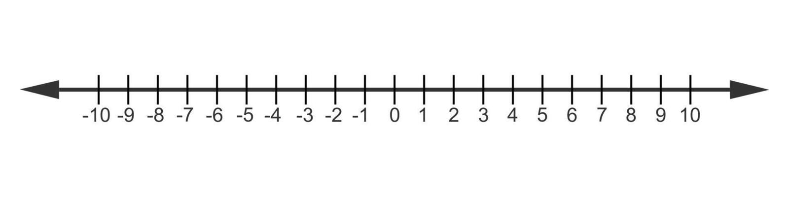
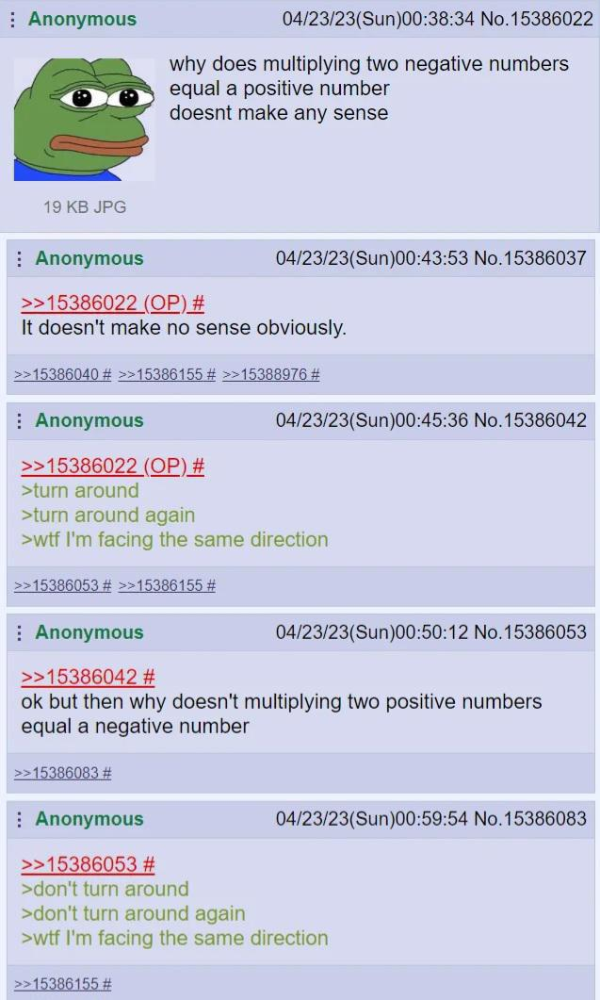

I wrote this a few years ago when I was first thinking about *writing* about math as a way of learning it. I really had wondered about why multiplying by $i$ caused rotations and why $e^{i\pi} = 1$, and decided this would be a good first foray for me. Much credit to [BetterExplained](https://betterexplained.com/articles/a-visual-intuitive-guide-to-imaginary-numbers/) which was very helpful for me.

---

## Introduction to the question

Both teachers and students tend to give up on 'having a feel' for imaginary numbers pretty quickly. Imaginary numbers are chalked up as a book-keeping tool or algebraic gymnastics rather than 'real-life' numbers like counting numbers, fractions, or negative numbers. The name, meant to be derogatory, doesn't help, of course. I personally learned imaginary numbers this way, as a construct of convenience that shouldn't be thought about too hard, and made it several years into college math with that attitude--I knew the rules, how imaginary and complex numbers behaved and everything. All without 'having a feel'. However, every once in a while, a teacher would make an offhand comment belying a real intuitive understanding of imaginary numbers, often having something to do with rotation. I would glance around flabbergasted only to see several classmates nodding knowingly. After revisiting imaginary numbers, I'd like to share a more intuitive explanation of what imaginary numbers are and how they add to our system of numbers.

## An analogy with negative numbers
Now, I will not make the case the imaginary numbers are anything more than a sophisticated book-keeping device or just a convenient construct. I will make the case that all numbers are that way, including negative numbers and fractions, only most people are more familiar with some of them.[^math-rules]

Negative numbers were also considered absurd and made-up once. It isn't so difficult to understand why. How can Jimmy have 4 cookies and give away seven? How can anybody have less than nothing of anything? However, negative numbers fill a gap in the number system and simplify, if not outright facilitate, many mathematical problems. Furthermore, they were more accepted when represented with an elegant geometry that fit cleanly with the geometry of positive numbers.

Consider that $7 - 4 = 3$. Very simple and straightforward. I might think of this problem as asking "What number x, if added to four, makes seven?" and you would say, "Why, three of course." Now, anyone could rearrange this question to ask, "What number y, if added to seven, makes four?". Without negative numbers, even if you know the difference between four and seven, you can't express this difference in direction. You would need to say, "That doesn't make any sense, but three added to four is seven." There is a gap here.

So, we invented a convenient book-keeping device that makes this simpler. Even before negative numbers were considered legitimate, and before mathematicians imagined them on a number line, they were used in algebra. As an example: Suppose you want to find two numbers whose sum is 10 and whose product is 21. You can set that up like so.$$x(10 - x)=21 \rightarrow x^2 -10x + 21 = 0 $$This problem can be solved quite simply by completing the square, but only with an "intermediate debt", or with a book-keeping negative number that disappears by the end of the problem.
$$
\begin{aligned}
x^2-10x+21&=0 \\
x^2-10x&=-21 \\
x^2-10x+25&=4 \\
(x-5)^2&=4 \\
x-5 = 2 \quad \text{and} \quad x-5 &= -2 \\
\text{So} \quad x=7 \quad \text{and} \quad x &= 3
\end{aligned}
$$

Voilà! We used some negatives for "keeping track" but they disappeared in the solution. This is how many mathematicians, even Euler, often thought of negative numbers.

Additionally, with negative numbers, it is very easy to say "negative three is the number that added to seven makes four", and I can simply write $4 - 7 = -3$. Nowadays, first graders are supposed to understand what centuries of mathematicians were skeptical of--and the intuitive device that has made all the difference is the number line.

We can see very clearly here that all numbers exist on a line, with positive numbers extending from the center (0) to the right, and negative numbers to the left. Let's consider how some operations with each work on this number line.
- **Magnitude**: Magnitude asks *"How far is this number from zero?"*--and this distance is always positive. Under the hood, it is calculated like so.
- $$ |x| = \sqrt{x^2}|$$  
- **Addition**: Addition *translates* on the number line. Positive numbers translate in the positive direction (to the right), and negative numbers translate in the negative direction (to the left).  
- **Multiplication**: Multiplication by a number *scales* by its magnitude. $4 \cdot 12 = 48$ is to say that the magnitude of $48$ is $12$ $4\text{s}$. Multiplying by a positive number will scale a number in whatever direction it is already facing. Multiplying by a negative number will scale in the opposite direction the number is facing--or it *reflects*, then scales.  

A helpful way to think about multiplication is to think of an extra 1 in front. For example,
	$$
    \begin{aligned}
	3 \cdot 7 &= 1 \cdot 3 \cdot 7 \\
	&= 21
	\end{aligned}
	$$

Adding the one in front reminds us to think of all numbers as being scaled from the identity, one. Positive numbers in the positive direction, negative numbers in the negative direction.

This is why Gauss suggested we call negative numbers *inverse* numbers.[^gauss] $-3$ and $3$ have the same magnitude, they just "face" different directions. In addition, they add the same amount just in different directions. Likewise, when multiplied, they scale a number by the same amount, just in different directions. Thinking about these numbers and these operations on the number line makes negative numbers intuitive and real.

## Enter imaginary numbers
Now let's consider a different elementary issue of algebra. The equation $$x^2 = 4$$is simple to solve. Both $2$ and $-2$ squared are equal to $4$, so we have our roots. Now what would happen if I were to tweak this just a little bit? $$x^2 = -4$$Well now I'm in trouble (without imaginary numbers). Squaring either a negative or a positive number results in a positive number, so there is no way to square something and arrive at $-4$. To fill this gap in the number system, a theoretical, convenient number was invented: $i$. The special thing about $i$ is that $i^2=-1$. $i$ allows me to solve this problem with $2i$ and $-2i$.

This is the same process with negative numbers--an invention to fill a gap and allow a solution to be written. This invention has proved to be as useful and as elegant as negative numbers, and has a beautiful geometric representation. Just as the diagram of the negative numbers extending the number line has helped mathematicians and students understand negative numbers more intuitively, so will a geometric explanation (conceived of after imaginary numbers had proven their mettle) make imaginary numbers more intuitive.

## A geometric interpretation
Consider that the equation $$x^2 = -1$$may be equivalently written$$1 * x * x = -1$$So the question posed by this equation can be written, "What transformation, when applied twice, turns $1$ into $-1$?"

If we try $x=1$, then $1 \rightarrow 1 \rightarrow 1$. If $x=-1$, $1 \rightarrow -1 \rightarrow 1$.

The problem with integers, as we saw earlier, is that scaling by any integer twice gets us a positive number. Scaling by a positive number keeps 1 on the same side throughout, and scaling by a negative number twice reflects to the negative side of the number line, then reflects back. So no number on the integer number line can scale 1 twice and make it to the negative side of the number line.

Imaginary numbers offer a whole new kind of transformation--a rotation! Imagine that multiplying by $i$ *rotates* $90$ degrees counterclockwise, so it is "halfway" to the negatives on the number line. Then, multiplying by $i$ again applies the same transformation and rotates the rest of the way to $-1$. We're there!

Similarly, we can multiply $1$ by $-i$ to rotate $90$ degrees clockwise, then multiply by $-i$ again to get to $-1$.

Note that counterclockwise being the positive orientation is purely a human convention, and could just as easily have been reversed.

Since $1 \cdot i = i$ is a $90$ degree rotation of the number $1$, $i$ is outside of the number line as we used to think of it. Just as we added the arrow pointing off into infinity on the left of zero to make the negative numbers, imaginary numbers add a *whole new axis* to the number line. There are the positive imaginary numbers $(i, 2i, 3i, ...)$ off to infinity pointing *up* from zero, and negative imaginary numbers $(-i, -2i, -3i, ...)$ off to infinity down from zero. $i$ is a whole new 'imaginary' dimension to measure a number with.

So we asked, essentially, "How can we transform $1$ to $-1$ in two identical steps," and arrived at "rotate $90$ degrees twice." This proves to be extremely useful.

*Note to add somewhere* When I learned about complex numbers, I was used to graphing $y \text{ vs } x$ on two real axes. Until fairly recently, I thought of the complex plane as a way to graph complex numbers the same way, without being something inherent to complex numbers. It was mysterious to me because the coordinate system worked by adding. So $3 + 2i$ is the coordinate at $(3, 2)$. I always thought it was an odd way to run a coordinate system. What I was missing is that the complex plane is just the new way to represent the number-line. When imaginary numbers are used, numbers now have two components: the real part and the complex part. Numbers are two dimensional now.

## Cyclical patterns
When multiplying by -1, a pattern emerges:
$$1, -1, 1, -1, 1, -1, ...$$

Multiplying by $-1$ just flips the sign. In fact, since imaginary multiplication introduced the idea of rotation, we can think of multiplication by $-1$ as a rotation of $180$ degrees (and a multiplication by $1$ as a rotation of $0$ degrees), which brings us to this pearl of mathematical intuition presented by some online chat.

Now let's piece out what the sequence of multiplying $i$ will be.

- $1$, just where we start.
- $1 \cdot i = i$
- $i \cdot i = -1$, remember that two $90$ degree turns is $180$ degrees.
- $-1 \cdot i = -i$
- $-i \cdot i = 1$, which is the same as $-1 \cdot i \cdot i$. Alternatively, you could think of this as starting at $1$, rotating $-90$ degrees, then rotating $90$ degrees to end up back at $1$.

Geometrically, we are taking 90 degree steps around the unit circle in the complex plane, repeating every four terms. This makes imaginary numbers great for modeling things that cycle in two dimensions, or circular relationships.

## Understanding complex numbers
Up to this point we have only talked about numbers on the *real axis* (where the imaginary part is zero) and the *imaginary axis* (where the real part is zero), but the new number system exists at all points in between--and there is a lot of new real estate. 

Consider the number $1 + i$. It has a nonzero real part ($1$) and a nonzero imaginary part ($i$). Graphed, it is located here on the extended number line.

Rather than rotating a full $90$ degrees to the imaginary axis, we are at a $45$ degree rotation.

You'll notice that adding imaginary numbers *translates* just like adding real numbers, just in new directions perpendicular to the real number line.

For an complex number $a+bi$, we can find the point on this complex number plane (the new name for our new extended number line) and imagine a vector starting at zero and ending at our coordinate to represent the complex number--it's like a triangle with the hypotenuse representing the number, and the sides representing the real and imaginary parts. This may feel new, but even with the old number line with just positive and negative numbers in one dimension, numbers were represented with a vector starting at zero and going a certain direction with a certain magnitude. We are only expanding the allowed directions to any direction in two dimensions!

"Complex number" is the name usually reserved for numbers with a nonzero real part and a nonzero imaginary part, but remember, imaginary numbers have just expanded the whole playing field for all numbers, so "complex numbers" just refers to "The new system of numbers as they are now constituted, including the innovation of imaginary numbers and numbers with both nonzero real and imaginary parts". But "Real numbers", numbers on the real axis with zero imaginary part, are *still* complex numbers, because they are a part of the new number system too. So complex numbers aren't a different animal or a different species of numbers, they're just from a part of the number map that doesn't always show up.

As for thinking about the size or the magnitude of these complex numbers, they work the same as real numbers--distance from zero. Since we're talking about two dimensions, we use the pythagorean theorem.
$$|a+bi| = \sqrt{a^2 + b^2}$$
For instance, if I want to find the magnitude of the number $1 + i$, or $1 + 1 \cdot i$, I can plug it into the formula.
$$
\begin{aligned}
|1 + 1 \cdot i|
   &= \sqrt{1^2 + 1^2} \\
   &= \sqrt{2}
\end{aligned}
$$

Part of why this is really slick is because it extends very nicely how we used to do magnitude for real numbers, or what we call absolute value. Absolute value measures a number's distance from zero, so $$ |-3| = |3| = 3$$However, the way we compute this under the hood is the square root of the square, since the square of real numbers is always positive.
$$|-3| = \sqrt{(-3)^2} = 3 = \sqrt{3^2} = |3|$$
When we added in imaginary numbers and the complex plane, we can say "Actually we were just doing the pythagorean theorem with a zero imaginary part", because
$$|-3| = |-3 + 0 \cdot i|=\sqrt{(-3)^2 + 0^2} = 3 = \sqrt{3^2 + 0^2} = |3 + 0 \cdot i| = |3|$$

So not only does this extension of the number line work very cleanly, but the extension of magnitude is also very clean and seamless.

## Complex multiplication
The great thing about complex numbers, and the first quality they were imbued with, is that *multiplying by a complex number rotates by its angle*. Recall that the number $i$ is at a $90$ degree angle to the real number line (where $0$ degrees is the ray pointing in the direction of the positive numbers and positive rotation is counterclockwise), and that multiplying a number by $i$ rotates it $90$ degrees. The same is true for $-i$ and $-90$ degrees.

Just like magnitude, this is a concept that applies cleanly to the plain old real number line. As we discussed earlier, multiplying by a positive real number applies $0$ degrees of rotation, and multiplying by a negative real number applies $180$ degrees of rotation, which matches their respective angles in the complex number system. So rather than thinking of multiplying by negative numbers as applying a $reflection$ then scaling, we think of all multiplication as applying a $rotation$ then scaling

This rule--that *multiplying by a complex number rotates by its angle*--is true for all complex numbers. Let's look at an example.

### Application: A ship's heading
The canonical example of why this is useful is the calculation of a ship's new heading.

Let's say you are the captain of a ship that is on a heading such that you travel three miles north for every mile east--so you are traveling north of northeast. You receive orders to change your direction by $45$ degrees.

What do you do?

The old, tired way to solve this problem is to sketch out some triangles, use pythagorean theorem and use inverse sine. It would be a great exercise to work it out right now! It'll also make a great comparison for how slick complex multiplication is.

Let our heading be the number given by $1 + 3i$, or our heading mapped onto the complex plane. Since we want to rotate by $45$ degrees, we can just multiply by the number $1 + i$, which has an angle of 45 degrees. We can foil out this product, and the only rule we need to remember is the most elementary property of all--that $i^2 = -1$.
$$
\begin{aligned}
(1 + 3i) \cdot (1 + i)
   &= (1 \cdot 1) + (1 \cdot i) + (3i \cdot 1) + (3i \cdot i) \\
   &= 1 + i + 3i + 3i^2 \\
   &= 1 + 4i   + 3(-1) \\
   &= -2 + 4i
\end{aligned}
$$

Converting the resulting complex number as our new heading, we will go $4$ miles north for every $2$ miles west--or $2$ miles north for every mile west. And we did the calculation in like 10 seconds, no sine or cosine or calculator necessary! We didn't get the new angle, but we didn't start with one either. With our new number system, rotation is just *baked in* to multiplication.

You may notice the *magnitude* of our vector was also transformed. Just like with real numbers, a number is scaled by the number it is multiplied by--in this case, by $\sqrt{2}$, since that is the magnitude of $1 + i$. If we are concerned with preserving the magnitude of our original heading, then we can multiply it by $\frac{1}{\sqrt{2}} + \frac{i}{\sqrt{2}}$, dividing by $\sqrt{2}$ to normalize the magnitude of our transformation.

## In conclusion
I hope to have established a jumping off point for complex numbers by establishing a solid, geometrically based intuition for what imaginary numbers are and why they are great and quite reasonable.

Hopefully, coming soon are the deep waters *worth diving into*, beginning with applying this intuition to complex arithmetic, and working towards understanding Euler's formula and Fourier transforms!

[^math-rules]: A very important and valuable thing mathematicians do is invent mathematical objects or improve existing ones in order to think more clearly or describe ideas more elegantly. All of numbers are examples of this.

[^gauss]: Gauss also entertained calling $i$ a "lateral" unit rather than "imaginary," precisely to strip away the connotation that it was somehow less real than negative numbers — a naming battle the "imaginary" camp ultimately won.