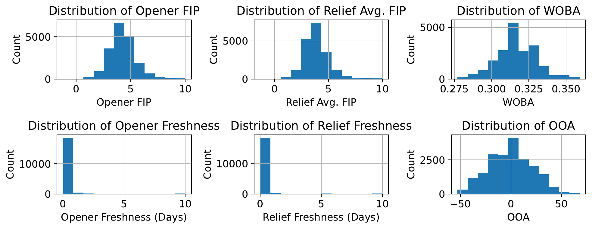
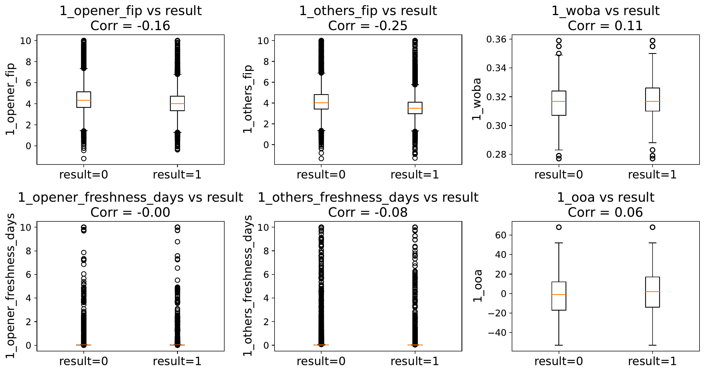
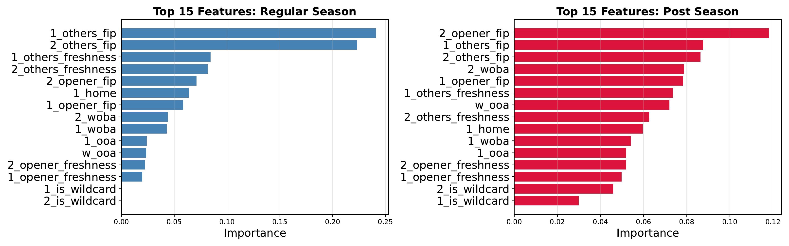

I'm not much of a baseball fan, but I love an underdog story as much as anybody. Just before the world series was set to start this year, my friend Jack (a diehard baseball fan) explained to me why he thought wildcard teams had an unexpected edge in baseball playoffs. For my part, I skeptically wondered if the showbiz of a wildcard win just made these cinderella moments more prominent in our memory, despite not happening as often as we perceive. We wanted an actual answer: is there something structural giving wild card teams an edge in the postseason, or is it just noise that people notice because upsets make better stories than expected results?

Alright, you got me, I had also watched Moneyball recently and was fired up about sabermetrics. Completely understandable.

You can find the full paper [here](Paper.pdf); this write-up walks through it, focusing mostly on how messy the data wrangling ended up being. The code behind the calculations and figures can be found in [this notebook](https://github.com/jackdpond/pitcher_post-season_effect/blob/main/notebooks/final_report.ipynb), along with extra validation and informative plots.

## Research Question
Regular season record is the obvious way to rank teams, but it's not obviously the right way to predict postseason success--especially for a team that snuck into October as a wild card rather than winning its division outright. So we asked: how should being a wild card team factor into predicting postseason success, if at all? A few analysts (FanGraphs, mostly) had already poked at pieces of this--clustering bullpen matchups, correlating regular season stats with playoff wins--and mostly concluded that the playoffs are close to random. We wanted to go further and actually rank which features matter most, using models built for exactly that.

## Data Set
We pulled two kinds of MLB data from 2014-2025: per-game pitcher logs from Baseball-Reference (FIP, innings, date, pitcher, team, win/loss) and team-level season stats from Baseball Savant (OAA, WOBA, whether the team made the playoffs as a wild card). Between the two we had enough to describe both the pitching and the team around it for every game across more than a decade of baseball.

The postseason is a tiny sliver of this--317 games out of roughly 20,000 regular season games--so anything about being a wild card only actually matters in that sliver. That imbalance isn't something to fix, it's just how many playoff games exist, but it does mean the signal we're after is buried in a mountain of regular season noise. Going in, our hypothesis was that wild card teams might carry hidden advantages that never show up in a season-long stat line: momentum from grinding through the wild card round while a division winner rests, and something like a chip-on-the-shoulder underdog effect.

## Data Cleaning and Feature Engineering
This was most of the actual work. We wanted a matchup-style dataset: one row per game, with each team's starting pitcher FIP, starting pitcher freshness, an aggregated bullpen FIP and freshness, average OAA, average WOBA, home/away, and wild card status sitting side by side. And of course, which team *won*.

Getting there from the raw pitcher logs took a few passes:

- We converted dates to actual datetimes, sorted by pitcher and date, and built a "freshness" column as days since that pitcher's last appearance--a pitcher's very first logged game just got assigned the dataset's max freshness value, since there was no prior appearance to diff against.
- We one-hot-encoded whether a pitcher started or came out of the bullpen, since a starter's FIP and a reliever's FIP mean pretty different things for a team's chances.
- We built a Game ID from the date and both teams playing, and dropped the rare doubleheader games where a team played twice in a day--a low-volume edge case that wasn't worth the extra handling.

The team-level season stats were cleaner, with one exception: WOBA was missing entirely for 2024. We filled it with the global average WOBA across all years, on the logic that a neutral filler does the least damage to a model that's trying to learn feature importance rather than predict individual games.

After merging the two datasets (formatted pitcher logs and team averages for WOBA, OOA, wildcard status) on team and year, we grouped by Game ID and by team, built a per-team stat dictionary for each game (starter FIP/freshness, bullpen FIP/freshness averaged, OAA, WOBA, home/away, wild card status), shuffled team order, and concatenated both teams' stats into a single row with a binary result column. One row got dropped for missing data; otherwise the dataset came together quite nicely.

Worth noting is that every stat in a game's row (FIP, freshness, etc.) reflects its value as of the *end* of that game, not before it started. For a model trying to predict future outcomes that would be leakage. But since we only cared about which features mattered, not about making real predictions, we treated this as fine--we wanted to know what correlates with winning, not forecast a game in advance.

## Data Visualization and Basic Analysis
The final dataset landed at 19,781 rows (one per game) and 20 features. Skill metrics like FIP, WOBA, and OAA came out normally distributed, as expected, while pitcher freshness was heavily skewed toward zero days of rest--makes sense, as most pitchers play pretty often.

When we split each of those same six features by win/loss, the distributions barely moved.

That was our first hint that baseball, at the level of any single stat, is stubbornly noisy--no individual feature cleanly separates winners from losers, which is exactly why we wanted a model that could weigh a bunch of them together instead of eyeballing correlations one at a time.

## Modeling and Results
We trained Random Forest and XGBoost classifiers, valuing interpretability (feature importance) over raw accuracy, with separate models for the regular season and the postseason. XGBoost outperformed Random Forest, landing at 0.701 accuracy/F1 in the regular season and 0.733 in the postseason.

We scored feature importance using XGBoost's **gain-based feature importance**, which is the average gain across every split that used that feature, summed across all trees in the ensemble. Features that are *discerning*, or that lead to big information gains when splitting on them, get high gain scores. This metric is *model*-based, and doesn't use test data at all. Gain-based feature importance can overstate features that offer lots of split points (like continuous features, FIP for instance), and may reward patterns that don't generalize. Pursuing a **permutation importance** score would be corrective of these issues.

With that said, let's look at the results. The most interesting shift: bullpen FIP mattered most in the regular season, but starting pitcher FIP took over as the top feature in the postseason, with offense and defense metrics (WOBA, OAA) also growing more important--consistent with October being a smaller-margin, higher-stakes version of the same game. As for our original question, wild card status barely registered, sitting dead last in both charts with an importance score of about 0.037. Wild card teams, as far as our models could tell, don't have some hidden structural edge--they just occasionally get hot.

## Conclusions
Unfortunately, Jack's hunch about a hidden underdog effect didn't hold up. Postseason success looks like it comes down to who's pitching, especially who's starting, more than whatever bracket position got a team into October.
