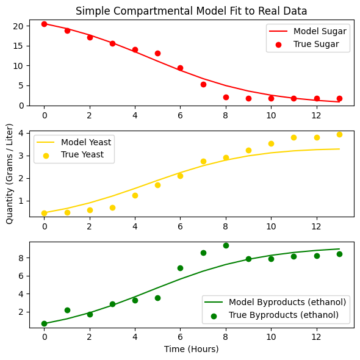
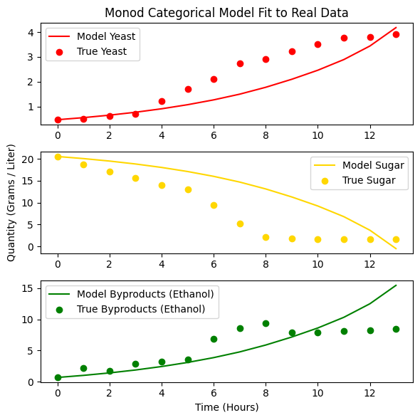
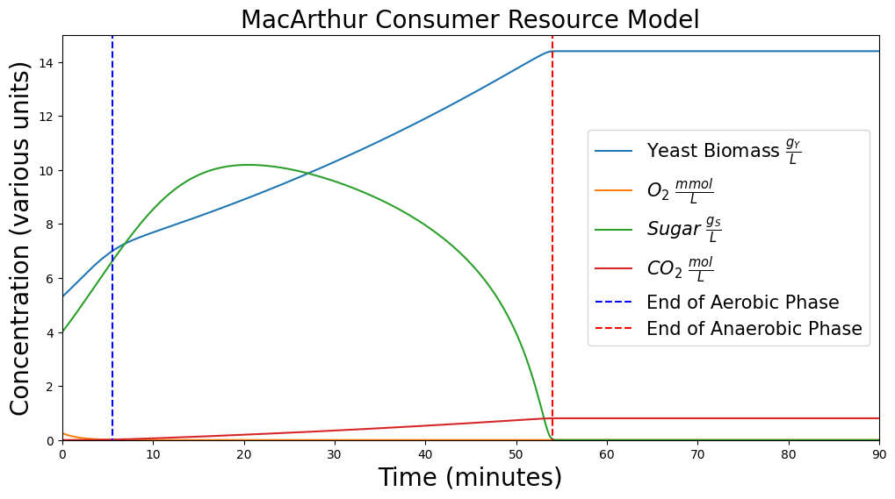

Shortly after my wife Jane and I started making sourdough, my friends Connor, Ethan, and I got the idea in our heads to use the compartmental models we were learning about in class to model the way yeast spreads in bread dough. It turned out to be a bit tricky--it's a fairly straightforward consumer-resource model, but with multiple resources that the yeast bacteria prefer differently, and with parameters that vary hugely loaf to loaf. We used a hierarchy of increasingly sophisticated models to capture more and more of these dynamics, but ultimately concluded that the simplest models appropriately captured the most improtant dynamics that ultimately explained the rise and fall of the *Saccharomyces cerevisiae* fungus. We had a lot of fun and learned a dollop of chemistry and microbiology along the way!

This write-up is a slightly modified version of the write-up on our repo's [README](https://github.com/EthanPrimes/modeling_yeast_spread), and you can also find a more complete and formal write-up of this project [here](paper.pdf). The actual Python code for fitting and predicting the yeast population can be found in this [Jupyter notebook](https://github.com/EthanPrimes/modeling_yeast_spread/blob/main/model_code.ipynb).

## Motivation and Set-up
It's difficult to make bread. The fact that small changes in the either the method of preparation or the environment (temperature, pressure, etc.) lead to large changes in the outcome make bread-baking an ill-conditioned process. At the same time, nearly everybody really likes good bread, so this problem deserves careful consideration. 

We consider a basic bread recipe that calls for baker's yeast, *Saccharomyces cerevisiae*, rather than sourdough, as the unpredictable cocktail of bacterial and fungal species in a sourdough starter makes any model either intractable or of no use. We attempt to construct a mathematical model that is able to predict the whims and vagaries of home-baked bread.

## Basic Chemistry of Bread
There are four primary ingredients in bread dough: flour, water, salt, and yeast. Flour provides not only the gluten that gives bread its structure, but also contains sugars that the yeast consumes. Salt strengthens the bread dough, making it more elastic.

Most of flour's sugar is actually locked up as starch, not free sugar yeast can use directly. Once water hits the flour, naturally-occurring amylase enzymes wake up and start chopping that starch into maltose (and eventually glucose), which is the actual fuel yeast ferments. Hydration doesn't just form gluten, it also starts the process that unlocks the release of yeast-digestible stugars in the flour.

Yeast consumes the available sugars in two phases: aerobic when oxygen is available, and anaerobic when oxygen is depleted. The presence of oxygen allows the yeast to synthesize more energy from the sugar it consumes, and the yeast multiplies much faster during the aerobic stage. Once oxygen is depleted, the yeast switches to less-efficient anaerobic metabolism with different byproducts.

## Modeling
We modeled the amount of yeast, sugar, $CO_2$, and sometimes other byproducts with four different models.

### Simple Compartmental
The first simple categorical model is a slightly modified SIR model. The main difference is that while the compartments represent concentrations, they do not sum to a constant value. Rather than mass or something analagous passing from one compartment to the next, a kind of "energy" or "life-force" passes from sugar to yeast to byproducts. The system of ODEs is given by

$$
\begin{align*}
    \dot{S} &= -\alpha \cdot S(t) \cdot Y(t) \\
    \dot{Y} &= \beta \cdot S(t) \cdot Y(t) - \gamma \cdot Y(t) \\
    \dot{C} &= \delta \cdot S(t) \cdot Y(t)
\end{align*}
$$

Note that $\alpha$ is not necessarily equal to $\beta$ because the amount of sugar consumed by yeast is related though not equal to the biomass added to the yeast, and the rate at which yeast consumes sugar is not comparable to the rate at which yeast reproduces.

We fit this model to data described in the paper with surprisingly good results.

### Compartmental Model with Monod Equation
This model is a slightly more sophisticated twist on the prior simple compartmental model in that it leverages an insight from the biologist Monod.

$$
\begin{align*}
    \dot{Y} &= \mu_{\text{max}} \frac{S}{K_s + S}Y \\
    \dot{S} &= -\frac{1}{Y_{X/S}} \dot{Y} \\
    \dot{P} &= Y_{P/S} (-\dot{S})
\end{align*}
$$

Monod's contribution here is that yeast growth shouldn't just scale linearly with the amount of sugar present in the dough--at some point the yeast's own machinery, not the sugar supply, becomes the bottleneck. Monod's $\frac{S}{K_s+S}$ term captures exactly this: when sugar is abundant it flattens out near 1, so growth approaches a hard ceiling of $\mu_{\text{max}}$, but as sugar gets scarce it drops off and growth slows in proportion to how little is left. We also swapped the two independent rate constants from the simple model for yield coefficients $Y_{X/S}$ and $Y_{P/S}$, which just say that biomass and byproduct show up in fixed proportion to the sugar consumed--more careful bookkeeping, rather than a new growth mechanism.

### MacArthur Consumer-Resource Model
This model is motivated by thinking of yeast as a consumer with two different resources, namely sugar and oxygen, each of which it metabolizes differently--at different rates, with different levels of efficiency, and with different byproducts. In fact, yeast metabolizes sugar differently depending on the amount of oxygen available. We consider the change in concentration of yeast, oxygen, sugar, and carbon dioxide.

$$
\begin{align*}
    \dot{Y} &= Y \bigg[w_O c_O O + [w_S^{ana}​+(w_S^{aer}​−w_S^{ana}​)f(O)]c_S S - m\bigg] \\
    \dot{O} &= -c_O O Y f(O) \\
    \dot{S} &= r_S S (1 - \frac{S}{P_S}) - c_S Y S \\
    \dot{C} &= Y  u_S  (1 - f(O)) \cdot .0111 \\ \\
    f(O) &= \frac{O}{k_O + O}
\end{align*}
$$

There are a lot of terms and parameters in this model; check out the appendix for an index. We cite both the values we used and the sources for those values in the more [official write-up](paper.pdf).

The real trick in this model is the switching function $f(O)$, which acts like a dial that slides between anaerobic and aerobic metabolism depending on how much oxygen is left. When oxygen is abundant $f(O)$ sits near 1 and yeast burns sugar through the efficient aerobic pathway, weighted by $w_S^{aer}$; as oxygen runs out $f(O)$ collapses toward 0 and that same sugar consumption switches over to the much less efficient anaerobic pathway weighted by $w_S^{ana}$--no separate model needed, just one continuous knob. Sugar gets its own logistic growth term since flour keeps releasing more of it as it's processed, rather than starting from one fixed pool like in the earlier models, and oxygen simply drains away as yeast metabolizes, scaled by that same $f(O)$ switch. In short, it's two Monod-style consumer-resource pairs sharing a single dial that decides which one yeast leans on. 

Of course, the standard MacArthur Consumer-Model isn't a perfect fit. My understanding is that this kind of Consumer-Resource model is used to capture the dynamic of a predator (say, a coyote) with multiple sorts of prey (rabbits and squirrels), but with different chances of encountering and eating different sorts of prey, and with different benefits from different sorts of prey. For instance, a coyote might eat more squirrels but rabbits are a bigger meal. For this model of yeast, oxygen and sugar are not different resources that the yeast consumes separately, but rather the presence of oxygen makes yeast better at consuming the primary fuel, which is sugar. We feel that this formulation more or less captures this dynamic. 

Unfortunately, despite digging, we were unable to find data against which to validate this model. However, qualitatively, it matches what we expect. The amount of yeast grows quickly at first, then slightly slower when oxygen is depleted (which happens quite quickly), then levels out once sugar is completely depleted. The amount of sugar in the loaf grows as the flour is processed and then decreases once the rate of yeast's consumption overtakes the slowing rate of sugar increase. The amount of $CO_2$ slowly increases throughout, and at a higher rate during the aerobic phase.

## Appropriateness of Models
The two compartmental models captured the changing concentrations of their assumed dynamics with surprising accuracy, considering their simplicity. The fitted simple compartmental model yielded a mere 21% error for the glucose consumed to ethanol produced ratio. However, the assumed dynamics are quite a far cry from the dynamics of a rising loaf of bread dough. The most egregious simplifiying assumption was that all sugar is initially available and does not replenish. Fortunately experimental data that matched the assumptions validated these models nicely. 

The most complex model we attempted to use, the MacArthur Consumer- Resource model, corrected the previous simplifications by including terms to describe 1) a replenishing supply of available sugar, 2) a variable rate of sugar consumption and yield depending on the oxygen supply, and 3) metabolism of oxygen when available. Although we were unable to find or produce experimental data to validate this model, we found it satisfactory qualitatively. The phases of aerobic metabolism, anaerobic metabolism, and equilibrium are each amenable to visual inspections of the figures the model produces.

## Impact
The impact of an accurate bread-rising model would be profound and far-reaching. Bread is a worldwide staple, and is much beloved by nearly all cultures. An accurate model would create tremendous accessibility to consistently higher quality bread, exactly as desired by its bakers, despite its complexity.

Such a day is yet beyond us. Using the models we produced, by fiddling with initial values, a user can easily see the effects of changing the initial concentrations of yeast, sugar, and oxygen, and use these initial concentrations to create the desired effect while baking bread, though those changes are qualitative and not truly very predictive.

Much work remains to be done.