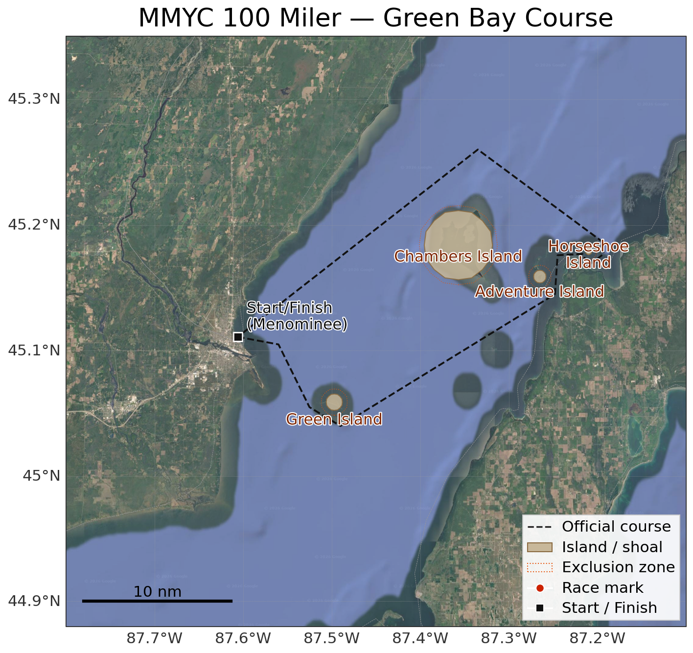
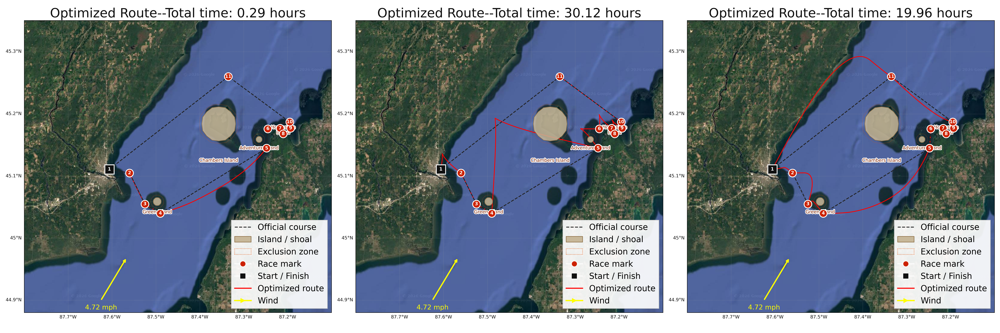

Every year the Menominee, Michigan Yacht Club hosts the (42 mile) "100 Miler" the weekend after the more intense Chicago to Mackinac race (older than the world series or the Indie 500) in Lake Michigan, and a few weeks after the Bayview to Mackinac race (the longest freshwater race in the world). THe 100 Miler is a smaller, lower-key event that many Great Lake sailors use as a fun follow-on race, nearby why they just finished. It's billed as a family friendly race, not the marathon slog that the Mac races can be, and is genuinely a very fun community event. The marina is beautiful, and they don't stop at hosting the race, but also host a few very midwestern shin-digs the same weekend, before and after the race.

, with the original caption "Sailors make their way back to Menominee after sailing around Green Island during the 2019 Joey Shepro Memorial Doublehanded Race (credit Val Ihde)"](miler1.jpg)

A lot of people don't know there is excellent sailing in Wisconsin! People forget it's not landlocked, and few people who haven't seen the Great Lakes know that their conception of "Ocean" or "Sea" is a closer fit than their conception of "Lake." One of the four original US sailing centers, used for Olympic training, is in my hometown, Sheboygan, Wisconsin. It's a real destination. A very mathematical write-up of an optimization problem is my own way of marketing to a specific audience that likely hasn't gotten the Lake Michigan sailing pitch yet.

My brother is a Great Lakes racer, and I got to see him off on the 2025 100 Miler last year. When my friends Ethan and Connor and I were casting around for a well posed but challenging optimization problem, we quickly settled on the 100 Miler. The wind-sail locomotion is such an interesting dynamic, and we thought the short course would be more tractable than a longer race with more legs.

The course itself is an 11-leg loop out of Menominee, around Green Island, up past Chambers and Adventure Island, out to a mark near Horseshoe Island, and back--with a few exclusion zones around the islands and shoals that a boat obviously can't sail through.

Here is a more official [write-up](Paper.pdf), and you can see the source code [here](https://github.com/EthanPrimes/vol4-second-project). Ethan and Connor and I also presented this project at a poster session, with this [poster](poster.pdf).

## Setting Up the Problem
Every version of this problem is an optimal control problem: find the control (the boat's heading, $\theta(t)$) that steers the state (the boat's position, or later, position and velocity) from a fixed start to a fixed end in the least time. In every model, the functional we're minimizing is just total time,
$$ J[u] = \int_{t_0}^{t_f} 1 \, dt, $$

subject to whatever dynamics $\dot{\mathbf{s}} = f(\mathbf{s}, \theta, t)$ we're using for that model, plus fixed endpoints.

Pontryagin's Maximum Principle is the tool that turns "find the best function $\theta(t)$" into a system of ODEs we can solve. The recipe is the same every time: build the Hamiltonian $H = \boldsymbol\lambda(t)^\top f(\mathbf{s}, \theta, t) - 1$ (the $-1$ is just the running cost of time itself), then the optimal trajectory has to satisfy $\dot{\mathbf{s}} = \partial H/\partial \boldsymbol\lambda$ (which just gives back our original dynamics), $\dot{\boldsymbol\lambda} = -\partial H/\partial \mathbf{s}$ (the costate equations), and $\partial H/\partial \theta = 0$ (the control has to be a critical point of the Hamiltonian at every instant). Since our final time is free and there's no cost tacked onto arriving late or early, we also get $H(t_f) = 0$ as a boundary condition.

The costates $\boldsymbol\lambda(t)$ are worth dwelling on, since they're the least intuitive part of all this. Think of $\lambda_1, \lambda_2$ as a kind of compass needle riding along with the boat--they point in the direction that a tiny nudge in position would most increase your remaining "value" (here, negative time-to-finish). The stationarity condition $\partial H/\partial \theta = 0$ is just saying: steer so your velocity vector lines up as well as possible with that compass needle.

## Model 1: Zermelo Navigation (the warm-up)
We started as simple as possible: a motorboat moving at a fixed speed $v$, steered by heading $\theta$, pushed around by a current $\mathbf{w}(x,y)$. No wind, no sails, just a motor and water moving underneath you. This is the classical Zermelo Navigation Problem. The dynamics are
$$ \begin{bmatrix} \dot x \\ \dot y \end{bmatrix} = v\begin{bmatrix}\cos\theta \\ \sin\theta\end{bmatrix} + \begin{bmatrix} w_1(x,y) \\ w_2(x,y)\end{bmatrix}, $$

so the Hamiltonian is
$$ H = \lambda_1\big(v\cos\theta + w_1\big) + \lambda_2\big(v\sin\theta + w_2\big) - 1. $$
Since $v$ is just a constant here, the costate equations only pick up current-gradient terms,
$$ \dot\lambda_1 = -\lambda_1 \frac{\partial w_1}{\partial x} - \lambda_2 \frac{\partial w_2}{\partial x}, \qquad \dot\lambda_2 = -\lambda_1 \frac{\partial w_1}{\partial y} - \lambda_2 \frac{\partial w_2}{\partial y}, $$
and stationarity works out cleanly to $-\lambda_1 v \sin\theta + \lambda_2 v \cos\theta = 0$, i.e. $\tan\theta = \lambda_2/\lambda_1$--the boat should always just point straight along its costate vector. We solved this (and the very similar Model 2, below) as a boundary value problem with `scipy.integrate.solve_bvp`, treating the unknown finish time as a parameter by rescaling the whole problem to run from $t=0$ to $t=1$.

This model is a warm-up rather than a real answer, and it shows: a motorboat that ignores wind entirely and just muscles across at constant speed finds a nearly straight-line path, only adjusting for a weak current, which is obviously not how sailing works. But it's a useful sanity check on the machinery before we made the dynamics actually resemble a sailboat.

## Model 2: Square Sails
We're not actually sure how square-rigged ships work, but we assume that they just get pushed in the direction the sail is facing, at a speed proportional to how "exposed" the sail is to the wind. This would prevent the boat from traveling in a trajectory that has any component upwind. If $\phi$ is the wind's heading, the boat's velocity becomes
$$ \begin{bmatrix} u_1 \\ u_2 \end{bmatrix} = v\begin{bmatrix} \cos(\theta - \phi)\cos\theta \\ \cos(\theta-\phi)\sin\theta \end{bmatrix}, $$
where $\cos(\theta - \phi)$ is just the dot product between the boat's heading and the wind direction--full push when running downwind, zero push at 90° to the wind, and *negative* push past that. The Hamiltonian has the exact same shape as Model 1's, just with this new $v(\theta, \phi)$ baked in, which is why we implemented it as a generic velocity function from the start: Models 1 and 2 turned out to be almost the same code.

The catch is that a square sail literally cannot generate force against the wind--there's no mechanism here for the boat to make any upwind progress at all. So this model was never going to "discover" tacking, no matter how good our solver was. We needed a fundamentally different sail.

## Model 3: Triangular Sails, and Discovering Tacking
Triangular sails don't work by the wind "pushing" against their fabric. They act more like an airplane wing turned on its side: wind moves faster over the leeward face than the windward face, the pressure difference *pulls* the sail (and boat) forward, and this lets a boat sail up to about 40° or so off directly into the wind. Because the sail is asymmetric, though, there's a second no-go zone directly downwind where the sail gets unstable. So real sailboats zig-zag around both no-go zones--tacking when zig-zaggin upwind, jibing when zig-zagging downwind.

, with the original caption "Jesse Peterson’s Sadie Hawkins and Rick Estebo’s Eagle XXX battle for second place during the final leg of the 2019 Joey Shepro Memorial Doublehanded Race (credit Val Ihde)"](miler2.jpg)

We captured this by keeping the exact same dynamical structure as before,
$$ \begin{bmatrix} \dot x \\ \dot y \end{bmatrix} = v\big(\theta(t), \phi(x,y)\big)\begin{bmatrix}\cos\theta \\ \sin\theta\end{bmatrix} + \begin{bmatrix} w_1(x,y) \\ w_2(x,y) \end{bmatrix}, $$
but swapping in a $v(\theta, \phi)$ fit to match real sailboat polar diagrams instead of a simple cosine--including the two no-go zones. The Hamiltonian and costate equations are structurally identical to Model 1's, just carrying the extra $\partial v/\partial \theta$ term through stationarity:
$$ \frac{\partial H}{\partial \theta} = \lambda_1\left(\frac{\partial v}{\partial \theta}\cos\theta - v\sin\theta\right) + \lambda_2\left(\frac{\partial v}{\partial \theta}\sin\theta + v\cos\theta\right) = 0. $$

The numerics here proved to be too much for our `scipy.integrate.solve_bvp` solver. The optimal path through a no-go zone isn't smooth--it has a sharp corner where the boat instantly snaps from one tack angle to the other--and `solve_bvp` assumes smooth solutions, so it broke on these legs. We switched to treating the whole thing as a direct nonlinear program instead: discretize the path into $N$ points with a leapfrog Euler scheme,
$$ (N-1)(x_{i+1} - x_i) = T \cdot v(\theta_i, x_i, y_i)\cos\theta_i, \qquad (N-1)(y_{i+1}-y_i) = T\cdot v(\theta_i,x_i,y_i)\sin\theta_i, $$

enforce those as equality constraints, and hand the whole thing to `IPOPT` via Julia's `JuMP`, minimizing total time $T$ directly instead of solving the costate ODEs by hand. This sidesteps the smoothness assumption entirely, at the cost of being extremely sensitive to the initial guess--we ended up seeding most legs with a straight-line path and a single heading switch partway through (simulating one tack), which worked well except on the two legs that didn't need a direction change at all, and one leg that broke the solver no matter what we tried.

The upside: this formulation *did* rediscover tacking and jibing on its own, with no hints from us beyond the sail physics. The downside is that the raw solution rattles back and forth between headings extremely fast, which looks like a fuzzy straight line solution. We fixed this issue with a small penalty term on how fast $\theta$ is allowed to change, and then the solver settled into a "one direction change per leg" policy to minimize that penalty.

## Model 4: Acceleration and Land Penalties
The last simplification we wanted to drop was treating wind and current as directly setting the boat's *velocity*. Real boats have mass and accelerate into a new speed rather than jumping to it, so we added two more states, tracking velocity explicitly:
$$ \frac{d}{dt}\begin{bmatrix} x \\ y \\ \dot x \\ \dot y \end{bmatrix} = \begin{bmatrix} \dot x \\ \dot y \\ a(\theta,\phi)\cos\theta \\ a(\theta,\phi)\sin\theta \end{bmatrix} + \begin{bmatrix} 0 \\ 0 \\ \tilde w_1(x,y) \\ \tilde w_2(x,y) \end{bmatrix}, $$
with an acceleration function $a$ playing the role $v$ used to. Now we have four costates instead of two, and the Hamiltonian
$$ H = \lambda_1 \dot x + \lambda_2 \dot y + \lambda_3\big(a\cos\theta + \tilde w_1\big) + \lambda_4\big(a\sin\theta + \tilde w_2\big) - 1 $$
gives costate equations where the position costates feed directly into the velocity costates,
$$ \dot\lambda_3 = -\lambda_1, \qquad \dot\lambda_4 = -\lambda_2, $$
which has a nice mechanical flavor to it--position "value" accumulates into velocity "value" the same way momentum accumulates from force. The remaining two costate equations and the stationarity condition on $\theta$ carry the same $\partial a/\partial \theta$ structure Model 3's did, just with $a$ in place of $v$.

One physical wrinkle: a boat's acceleration depends on *apparent* wind (the wind it actually feels, net of its own motion), not the true wind--otherwise a boat on a fixed heading would accelerate forever. We estimated that a racing sailboat takes about 30 minutes to reach top speed on a given heading and built that time constant into $a$.

We discretized this the same way as Model 3 (leapfrog Euler across all four states, solved with `IPOPT`/`JuMP`), reusing the single-tack initial guess. This version was, somewhat surprisingly, much friendlier to the solver than the discontinuous velocity-based model--no special-casing needed, and it converged quickly on every leg. Adding the acceleration physics smooths the solution implicitly.

### Land Penalties and KKT Conditions
Because we'd already switched to a constrained nonlinear program, adding coastlines was easy: we traced coastline points off satellite images with WebPlotDigitizer, interpolated them into functions $\text{north}(x)$ and $\text{south}(x)$, and added inequality constraints $\text{south}(x_i) \le y_i \le \text{north}(x_i)$ at every timestep.

Adding inequality constraints to a Pontryagin-style problem means reaching for KKT conditions instead of plain stationarity. If $\mathbf h(x,y) \preceq \mathbf 0$ describes the excluded region around an island or coastline, the Lagrangian picks up a multiplier term,
$$ \mathscr{L} = H - \boldsymbol\mu(t)^\top \mathbf h(x,y), $$
and the position costates absorb an extra piece pushing the boat away from the boundary whenever the constraint is active:
$$ \dot\lambda_1 = -\frac{\partial H}{\partial x} + \boldsymbol\mu(t)^\top \frac{\partial \mathbf h}{\partial x}, \qquad \dot\lambda_2 = -\frac{\partial H}{\partial y} + \boldsymbol\mu(t)^\top \frac{\partial \mathbf h}{\partial y}. $$
The velocity costates are untouched, since land doesn't care how fast you're going, only where you are. Optimality now requires $\partial \mathscr L/\partial \theta = 0$ alongside the usual complementary-slackness trio, $\mathbf h \preceq \mathbf 0$, $\boldsymbol\mu \succeq \mathbf 0$, and $\mu_j h_j = 0$ for every constraint $j$--the multiplier is only "switched on" while the boat is actually pressed against a boundary. We also experimented with soft penalty costs like $1/d^n$ (distance to the coastline) as an alternative to hard constraints, but these made an already touchy nonlinear program noticeably harder to solve, especially for the acceleration model.

## Comparing the Models
Lining up the routes side by side made the story of increasing realism pretty obvious.

The motorboat (left) crosses in about 17 minutes flat, in a nearly straight line. A motorboat would be cheating though. The velocity-relation sail model (middle) is the first one to rediscover tacking on its own, but the path is visibly jagged, snapping between headings, and one leg (11) broke the solver badly enough that we left it off the figure entirely. The acceleration-relation model (right) produces smooth, physically believable curves that still tack exactly once per upwind leg, though more smoothly, and finishes in just under 20 hours--in the right ballpark for real 100 Miler finishing times from the year we pulled wind and current data for.

Only models 3 and 4 "discovered" tacking, since they both had no-go zones and were able to make progress upwind.

## What Real Sailors Do Differently
Our models assume constant wind and a lone boat on the water, so a single tack per leg is genuinely optimal under those assumptions. Real racers tack far more often than that, for two reasons our models don't capture: 1) wind constantly shifts in both speed and direction, so sailors switch tacks opportunistically to catch favorable shifts and hedge against unfavorable ones, and 2) right-of-way rules incentivize extra tacks, both to stay clear of other boats and to force competitors into worse positions. Waves, wind shadows behind land, and the presence of other racers were all things we chose not to model.

## Impact
Beyond just family-friendly local sailing races, this kind of problem is increasingly showing up in emerging industries. Wind-powered cargo shipping harnesses wind power to directly power cargo ships. One company, Vela, already runs a fully wind-powered trimaran on an trans-Atlantic route, cutting costs and pollution. The problem of how to route a wind-powered vessel optimally, factoring in wind, current, and coastline constraints, is a real question for global supply chain efficiency and climate impact.

And if you, dear reader, are convinced you have what it takes, come on down to Menominee this summer, we'd love to see you there.

