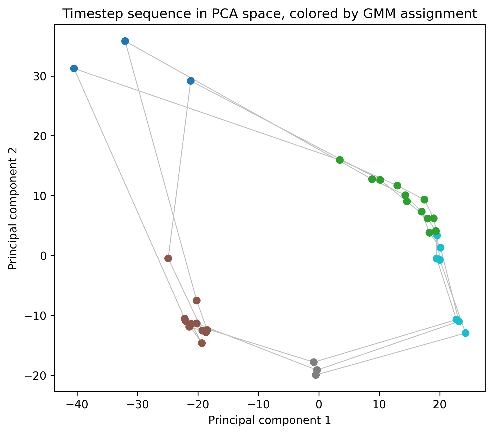
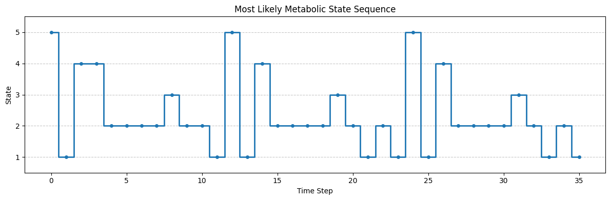
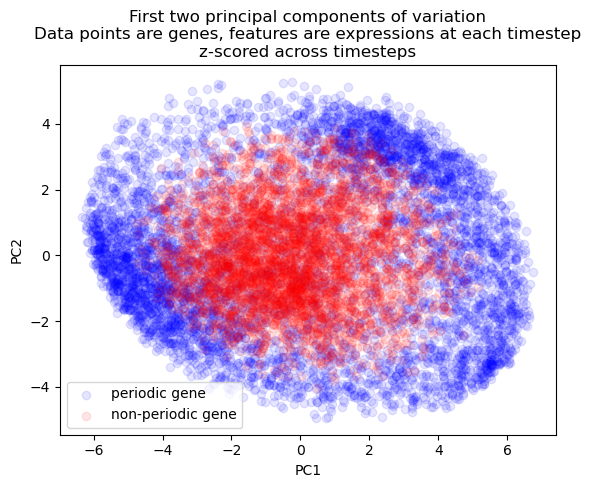
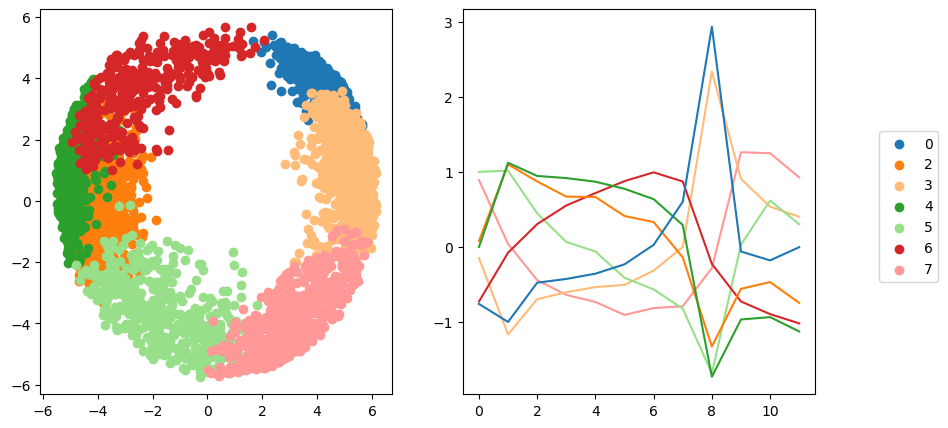
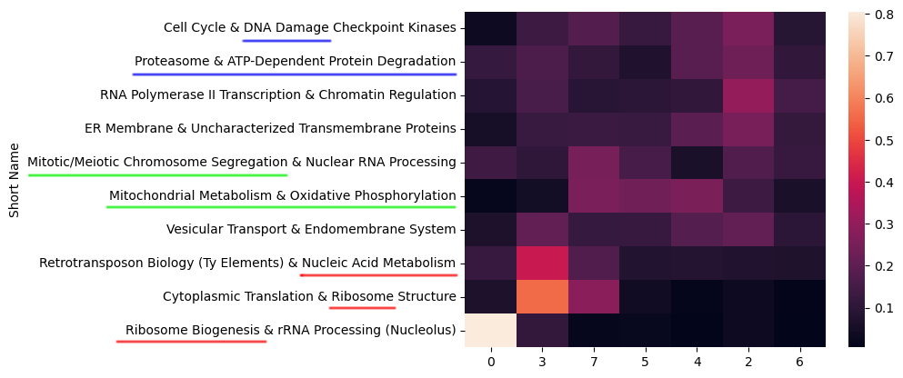
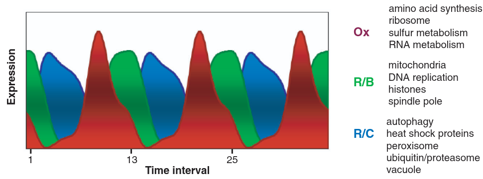

## Some background on RNA transcriptomics
Your *genome* is the full library of genetic instructions in each cell in your body, stored in DNA strands. It's essentially static (hopefully) and doesn't change moment to moment or cell to cell. Those genes are *active* when a gene's DNA sequence is copied to a strand of RNA, which is like an email of instructions to the cell's ribosomes. The process of copying is called *trasnscription*. The ribosomes fabricate proteins, and the proteins determine what the cell is *doing*--building, metabolizing, fighting invaders, reproducing. The *transcriptome*, by contrast to the genome, is the complete set of RNA molecules in a cell at a given moment. It *does* change moment to moment, corresponding to which genes are active from moment to moment. *Transcriptomics* is the process of measuring that set.
This is a project completed by my friends Isaac, Henry, Wyat, and me for a final project in a data-driven modeling class. A few weeks in we pivoted to something with a cleaner question attached to it: a yeast microarray time series from a 2005 *Science* paper, where a culture of budding yeast, grown under starvation conditions, falls into a spontaneous, synchronized metabolic oscillation--the whole population lurches between oxidative and reductive metabolism every few hours, like a very slow, very chemical strobe light. This is apparently my second yeast-related project on this site; I promise I don't only think about yeast.

The original paper found a ~300 minute period and three broad phases of gene activity using k-means and an autocorrelation-based period search. Our goal was to independently verify their period and phase structure using different tools--GMMs, hidden Markov models, permutation testing, topic modeling--and see whether we could push the resolution past their three clusters.

You can find the [full paper](paper.pdf) and [slide deck](slides.pdf) for more detail; this write-up hits the highlights.

## The Data
The dataset is 36 microarray samples taken every 25 minutes from an oscillating yeast culture, each measuring the relative abundance of 9,725 RNA transcripts (about 6,400 of which map to known yeast genes). That's an uncomfortable shape for a dataset--36 rows, 9,725 columns--and a good deal of the analysis amounts to coping with that imbalance in different ways.

Two preprocessing choices mattered downstream. Raw intensities span many orders of magnitude, and higher-intensity transcripts tend to have higher variance too, so we applied an arcsinh transform,
$$ \text{arcsinh}(x) = \ln\left(x + \sqrt{x^2+1}\right), $$
which behaves like a log transform for large values but, unlike log, is well-defined at zero--a real concern here, since plenty of transcripts show zero measured intensity at some timesteps. Depending on the analysis, we also sometimes Z-scored each transcript's own time series (subtracting its mean, dividing by its standard deviation across the 36 timesteps). Z-scoring throws away a transcript's absolute expression level entirely, but it's the right move whenever what matters is *when* something peaks rather than *how much* it peaks, which turned out to describe most of what we cared about.

## Finding the Period, Three Times
The original paper found its ~300 minute period with a maximum-likelihood autocorrelation search on the mean expression trend. We wanted to rediscover that period independently, so we ran three different unsupervised approaches at it.

The first attempt fit a Gaussian Mixture Model directly on the 36 timesteps, using the highest-variance transcripts as features, on the theory that high-variance transcripts are the ones actually discriminating between metabolic phases. This worked, in the sense that cluster assignments were stable no matter how many top transcripts we kept (200 to 1,100), but the assignments were so confident, essentially deterministic, that we suspected we'd overfit to noise in a 9,000-plus-dimensional feature space with only 36 data points to work with.

So the second attempt reduced dimensionality more aggressively: PCA down to 5 components, then a GMM with tied covariance (to keep the model from having enough free parameters to memorize the data) fit on that. To pick the number of clusters $k$ honestly, we trained on the first 24 timesteps and evaluated held-out log-likelihood on the last 12, sweeping $k$ from 2 to 7 over 100 random restarts each. $k=5$ won consistently. Plotting those 5-component PCA points in order and coloring by cluster produces a loop--not a metaphorical one, an actual closed loop in PCA space, which is about as clean a picture of periodicity as a dataset can offer.

The third attempt swapped the GMM for a proper hidden Markov model: a Gaussian-emission HMM (`hmmlearn`) fit on the same PCA-reduced representation, letting the model learn transition probabilities between states instead of treating each timestep as independent. The most-likely state sequence under the fitted HMM shows the same 12-step periodicity as the GMM did, which is reassuring--two fairly different models, one assuming independent observations and one explicitly modeling temporal transitions, agree on both the period and the number of underlying states.

Stable under wildly different feature counts, consistent across two different model classes, and matching the original paper's independently-derived 300 minute period--three approaches converging like that gave us enough confidence to call the period settled and move on to the more interesting question of which genes actually drive it.

## Which Genes Are Actually Periodic
Not every one of the 9,725 measured transcripts oscillates with the metabolic cycle--some are constitutively expressed, others are noisy without any real temporal signal. To sort periodic from non-periodic, we computed each transcript's own autocorrelation at a lag of 12 timesteps, the period we'd already found,
$$ r_{12} = \text{Corr}\big(x_t, x_{t+12}\big), $$
then shuffled each transcript's 36 values randomly 100 times and recomputed $r_{12}$ on each shuffle. A transcript's real $|r_{12}|$ had to beat 95% of its own shuffled versions to count as periodic--asking, essentially, "is this autocorrelation bigger than what pure chance would produce from this exact transcript's own value distribution?" 5,243 transcripts, a little over half, cleared that bar, which lines up well with the original paper's estimate.

Visualizing periodic and non-periodic transcripts by PCA on their Z-scored time series shows the separation you'd hope for: periodic transcripts spread out into a wide ring, while non-periodic transcripts pile up near the center, since a transcript with no consistent temporal shape has nothing to distinguish it in a space built entirely from *when* things happen.

## Sorting the Periodic Genes into Modules
With 5,243 periodic transcripts in hand, the next question was whether they all peak at the same point in the cycle, or whether finer structure exists--sub-groups of genes that peak early, late, or somewhere in between. We ran a classical time-series decomposition (a centered moving average to extract trend, then the residual seasonal component) on each periodic transcript, Z-scored those seasonal components, and clustered them with a GMM, using BIC to choose the cluster count. BIC favored 8 clusters, one of which turned out to be a catchall of transcripts with no coherent shared timing and got dropped, leaving 7 real temporal modules--already more granular than the 3 clusters the original paper found with k-means.

A UMAP projection of those modules produced the best-looking figure to come out of this project: the periodic transcripts arrange themselves into a genuine donut, with angular position around the ring corresponding almost exactly to the phase at which each module peaks.

## Where ARIMA Went to Die
Not every method survived contact with this dataset. We tried fitting ARMA models, both to individual transcripts and to lower-dimensional summaries (PCA components, cluster-mean trends), hoping to get a forecasting model out of the exercise. Individual-transcript ARMA fits ran fine but were uninteresting in isolation--the real goal was capturing interactions *between* transcripts, and every attempt at a multivariate version either failed to converge or produced nonsense coefficients. In hindsight this makes sense: ARMA assumes a covariance-stationary series, and ours is aggressively periodic, close to the textbook definition of "not stationary." First- and second-differencing, the usual ARIMA fix, didn't help either, since differencing removes trends, not oscillations--what we actually needed was seasonal differencing, which we didn't get to. A clean failure, but a useful one to write down.

## What the Modules Actually Mean, Biologically
Clusters of co-timed genes are only useful if you can say something about what those genes *do*. Each transcript in the dataset comes with natural-language annotation--gene names, descriptions, Gene Ontology terms--so we concatenated those fields into a small document per gene and ran Latent Dirichlet Allocation across all 9,725 of them, landing on 10 topics after iteratively expanding our stopword list until the topics stopped being dominated by uninformative filler words.

Raw LDA topics are lists of keywords, not labels, so to make them legible we handed the top 20 keywords per topic to Claude and asked for biologically-informed labels--things like "Mitochondrial Metabolism & Oxidative Phosphorylation" or "Ribosome Biogenesis & rRNA Processing," each grounded in specific keywords and GO terms rather than vibes. Cross-referencing each gene's dominant topic against its temporal module produced a heatmap with real structure in it: topics aren't scattered evenly across modules, they concentrate in specific phases of the cycle.

That ordering tracks the oxidative, reductive-building, and reductive-charging phase structure the original paper described from its own three gene clusters--our seven modules read as a finer-grained version of the same underlying biological story.

## Conclusions
The headline result is less a new discovery than a successful replication: three independent unsupervised methods (GMM, HMM, and permutation testing) recovered the same ~300 minute period and roughly the same fraction of periodic transcripts that the original 2005 paper found with completely different tools. Agreement across independent methods like that carries more weight than any single clever result--it's the kind of thing that earns a finding some trust.

Where we pushed past the original paper was resolution: seven temporal modules instead of three, each with a biologically coherent LDA-derived label, and a topic-module correspondence that tracks the original oxidative/reductive story while adding detail to it. None of us are biologists by training, so we're not the right people to fully interpret what those extra four modules mean--that's a conversation for someone who actually works on yeast metabolism--but the structure is there for someone to pick up.
