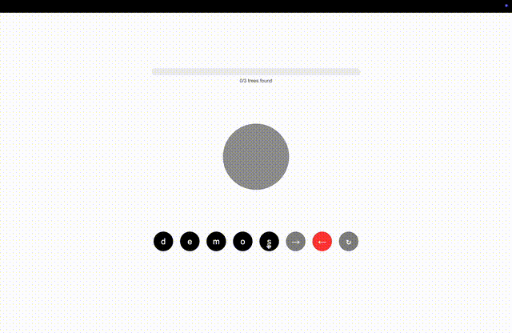

Given five letters, can you arrange them in a binary tree so that two different traversals (among breadth-first, in-order, pre-order, post-order) create two different valid words? Give it a try today! It may not be particularly satisfying, nor entertaining, but it's probably harder than you think.

[PLAY NOW](https://jackpond.com/treegram)



## Guide to the game
This section is expanded from the "How To Play" dialog on the Treegram site.

Treegram is a difficult word game that requires some knowledge of binary trees and how to traverse them. Let's dive in.

### Trees: 
A tree is a kind of graph or diagram, with nodes and connections between the nodes. Technically,  a tree is any graph where there is a path from each node to every other node, but not back to itself. We will only talk about rooted trees, with a natural hierarchy of parents and children. The one rule for a rooted tree is that each node may have however many children, but only one parent. This also means a node cannot share children with another node. The following is a tree:
```
                      1
                     / \
                    2   3
                   /   / \
                  4   5   6
```
The following is not a tree:
```
                    1   2
                     \ /
                      3   4
                       \ / \
                        5   6
                             \
                              7
```

This is not a tree because the 3 node and the 5 node both have two parents. Note that this means that nodes 1 and 2 share a child (3) and nodes 3 and 4 share a child (5)

In this game, we will add an additional restraint. We will only consider binary trees, which have the additional rule that a node may only have up to two children. The first example above is a binary tree since each node has 2 children or less.

### Traversals
There are four tree traversals that are key to play the game: 

#### Breadth First
This is the simplest traversal. Simply take the first layer of the tree, then the second, then the third, and so on, always from left to right.
For this tree:
```
                     1
                    / \
                   2   3
                  /   / \
                 4   5   6
```
The breadth first traversal would be 1-2-3-4-5-6.

#### Pre-Order
Pre-Order is the first of the ‘depth first’ searches. It is a recursive traversal, meaning that the traverser uses the same rule in a nested fashion—or the rule contains an application of itself. The rule is: print a node, then apply the rule to the left child, then apply the rule to the right child. If a node doesn’t have a left child, move the right. If it doesn’t have a right child, then that branch of the algorithm is done and you can move on to a right child higher up or finish.

It seems complicated but maybe an example will help.

For this tree:
```
                     1
                    / \
                   2   3
                  /   / \
                 4   5   6
```
The pre-order traversal would be 1-2-4-3-5-6.

#### In-Order
This traversal is similar to pre-order, but in a different order. First, apply the rule to the left child of the node, then print the node, then apply the rule to the right child of the node. If a node does not have a left child, print the node then move on to the right child. If a node doesn’t have a right child, then that branch of the algorithm is done and you can move on to a right child node up the tree, or finish.

For this tree:
```
                     1
                    / \
                   2   3
                  /   / \
                 4   5   6
```
The In-Order traversal is 4-2-1-5-3-6. Note that this rule ends up giving us a left-to-right, level-agnostic ordering of the whole tree.

##### A note
this traversal is called ‘In Order’ because when used on a binary *search* tree—-a binary tree with an additional rule—-this traversal prints the nodes in sorted order. The additional rule is that each left child must be *less than* its parent, and each right child must be *greater than* its parent. The example tree we have been looking at is not a binary search tree.

#### Post-Order
The last traversal is also similar to the previous two, with a predictable tweak. Apply the rule to the left child and the right child before printing the node. This gets a little surprising since all the descendants of a node get printed before it does.

For this tree:
```
                     1
                    / \
                   2   3
                  /   / \
                 4   5   6
```
The Post-Order traversal is 4-2-5-6-3-1.

### Gameplay
The player is given a list of letters in alphabetical order. Their goal is to arrange the letters in a binary tree so that different traversals yield different valid words. For sets of four or five letters, it is sometimes possible (rarely) to arrange a tree so that three traversals yield three different valid words. Such a tree is worth more points than a tree that only yields two words. 

For example: 
letters: ADEELPS
these may be arranged like so:
```
                     p
                    / \
                   l   s
                  / \   \
                 e   a   e
                          \
                           d
```
pre-order: pleased
in-order: elapsed

This is one tree the player could make but not the only one! The more trees made, the more points.

#### Some challenges to get you started
1. AEFST
2. APRST
3. OPSST
4. EIMRT
5. AEMNS
6. AELRT
7. CEEPTX
8. EHORSS
9. EORRST
10. ACDEILM
11. AEENRST

## Game history and development
I first had this idea when I first learned about binary tree traversals in a university data structures class. After looking at all the different orderings of numbers on the chalkboard, I sketched out the rough idea but couldn't find any solutions. I leaned over to my friend Ethan and whispered the idea and he tried for a few minutes but in the end we were both just left with a few half-hearted tree diagrams in our notebooks.

The idea stuck with me though. The next summer, when I was spending 2-3 hours commuting between Acton and Boston, I decided to spend the train time writing a brute-force solver. I couldn't think of a cleverer approach. The trickiest part was figuring out how to represent different trees and orders, and I am proud to be an independent discoverer of heap-ordering. The details of my solution are in the repo, but there is nothing particularly clever or nice about it.

The next summer my first experimentation with Claude was to use the chat interface to make a website to play my game. I had shown to a few friends who all clamored for me to keep it to myself. Undeterred, I used Claude to set up an online game... but as I knew nothing about online development, I thought I would need a server-side backend. I recently found out that the entire game was client-side except for a python script that selected the word-of-the-day. I set up a Render account and everything.

At some point I switched from the perhaps less than inspired name "WordTree" to the revelatory name "Treegram" that the game bears today.

Claude is much better today, and I know slightly more about web development, enough to ask to "please make the site completely client-side so I can host it on a static site." Here we are. I hope you enjoy.

## Future work
The obvious question to ask is "Are there any permutations that *can't* be achieved by the different traversals of a binary tree? Why?" 

A more careful phrasing of this question, is "Given that traversal A of a tree gives one ordering, which permutations of that ordering are achievable by traversal B?" I give this set of permutations the name $R(A, B)$. If a word-pair, where one is an anagram of the other, is in $\bigcup_{A \neq B} R(A, B)$ for $A, B \in /{\text{Breadth-First, Pre-Order, In-Order, Post-Order}}$, then there is a tree that is a solution to the Treegram game. Importantly, the majority of $S_n$ is not in $R(A, B)$.

This little problem is still leading me to delightful (and quite large) rabbit holes like Donald Knuth's [stack sorting](https://en.wikipedia.org/wiki/Stack-sortable_permutation), the whole field of [permutation patterns](https://en.wikipedia.org/wiki/Permutation_pattern)/ [pattern-avoidance classes](https://en.wikipedia.org/wiki/Enumerations_of_specific_permutation_classes) (which has *annual conferences*), [Catalan](https://en.wikipedia.org/wiki/Catalan_number) and [Motzkin](https://en.wikipedia.org/wiki/Motzkin_number) numbers, and forbidden patterns. It seems I've stumbled across a well-trod domain of problems. There is even a [2014 paper](https://personal.denison.edu/~kretchmar/pubs/TreeTraversals.pdf) by Feil, Hutson, and Kretchmar that explores an almost identical problem. The small twist with my version is the addition of Breadth-First search. Empirically, the cardinality of sets that include Breadth-First traversals lands on Motzkin numbers instead... and I'm working on figuring out why. Hopefully I'll get that write-up on here as an update soon.
